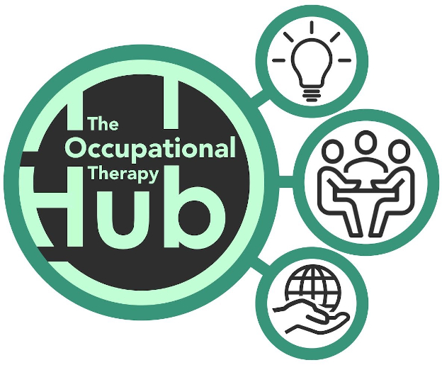

| [Home](../index.html) | [Previous Posts](../archive.html) |
| --------|--------|

 
##Two Inspiring Online OTs

***25th August 2019***

We're doing occupations. Welcome to the seventh blog post in this series. The main aim of this blog is to talk about Occupational Therapy and Occupational Science. 

Hi all, you probably heard that I quit OT blogging last month. I had a little occupational overload and thought I needed to cull one of my occupations, but I was wrong. I was re-inspired by the two OTs, Brock Cook and Jamie Grant who inadvertently inspired me to start my online OT journey. In late 2018, I firstly created my [Doing Occupations](https://www.facebook.com/doingoccupations) Facebook page to post some of my Occupational Therapy and Information Technology creations. I then created this simple OT blogging platform using Markdown and HTML, which is hosted for free on [GitHub](https://github.com/neilwoodroffe/doing-occupations).

The following is by no means a full account of Brock's and Grant's achievements in the OT or online worlds:

###Brock Cook

I first met Brock in about 2011, when he was working as an OT in Mental Health Services at the Royal Brisbane and Women's Hospital. A year or so after Brock had moved on from the RBWH, someone at work mentioned that Brock had developed a website called [MH4OT](https://mh4ot.com/). I was immediately impressed with his work and I have used his [Occupational Therapy Assessment Index](https://mh4ot.com/resources/ot-assessment-index/) on many occasions. Brock is obviously also the creator of the [MH4OT](https://www.facebook.com/groups/MH4OT/) Facebook group, which was inspired by [OT4OT](https://www.facebook.com/groups/311439915949/). In 2018, while searching for some CPD, I stumbled across Brock's Occupational Therapy podcast [Occupied](http://www.brockcook.com/category/podcast/) and I too became totally occupied.

###Jamie Grant

In 2018, I found Jamie's website, [The Occupational Therapy Hub](https://www.theothub.com/) during a Google search. I instantly signed up and was amazed with Jamie's idea to create an online community for Occupational Therapists. Jamie has also managed to recruit a team of OTs from around the world who share his vision. The Occupational Therapy Hub just keeps on getting better and you'll find heaps of Occupational Therapy resources (forum, articles, CPD, jobs etc.) when you join up for the free membership or you can now upgrade to the plus membership for an ridiculously low cost.

I highly recommend linking with OT4OT, MH4OT, Occupied and The Occupational Therapy Hub for CPD and to enhance your engagement in the OT profession. Hopefully one day I can catch up with these inspiring, online OTs to collaborate.

***Keep on doing occupations!***

[Neil Woodroffe, Occupational Therapist](../archive/meet_neil.html)

***

 Doing Occupations (2019) 
