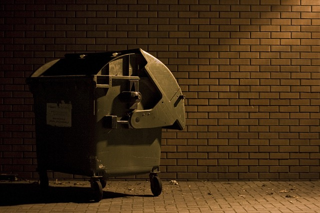
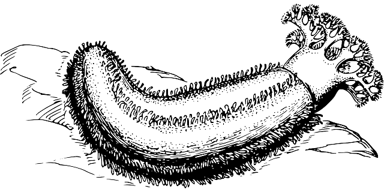

| [Home](../index.html) | [Older Posts](../archive.html) |
| --------|--------|

 
##Jaw Dropping Incidents

***16th June 2019***

We're doing occupations. Welcome to the sixth blog post in this series. The main aim of this blog is to talk about Occupational Therapy and Occupational Science. 

I have worked as an Occupational Therapist in Mental Health since 2008 and I've seen my fair share of jaw dropping incidents. I am going to share three real cases, that actually made my jaw drop. 

####The Industrial Bin

I was working with Mr K who was living at an emergency homeless shelter. I went to see Mr K and he was very excited to tell me that he had found a job at a local strip club. Mr K was vague about his role at the club, however he did claim that it was a paid position. Unfortunately I did not see Mr K again, as he went missing. Several months later we were informed by police that Mr K's body was found in pieces at the dump. An investigation identified that his body was originally placed in an industrial bin out the back of the strip club, where he had worked. Supposedly, the murder was associated with Mr K owing drug money.

####The Sea Cucumber

I was working in a Mental Health Community Care Unit and it was part of my role as an OT to engage clients in recreational activities. I accompanied a group of clients to the beach to go for a walk. Mr J picked up a sea cucumber and put it in his pocket. I asked Mr J what he was planning to do with the sea cucumber? Mr J instantly put the sea cucumber in his mouth and swallowed it whole. I was quite concerned because the sea cucumber was at about 2 inches in diameter and 5 inches long. I googled sea cucumber and found out that they may be poisonous to humans. I immediately took Mr J back to the unit and he was sent to emergency, luckily he was soon medically cleared with no concerns. 

####Big Pile of Guns

Mr S was referred due concerns about his decision making capacity and financial vulnerability, following the death of his mother. I organised for Mr S to be managed under guardianship and financial administration orders. Following the approval process, I received a letter from the police raising concerns about Mr S's capacity to hold a gun licence. I initially did not believe that this 64 year old vulnerable man would even hold a gun licence. I phoned Mr S and he advised that his mother had been supportive of him collecting antique rifles and pistols and he had held a gun licence since the 1970s. Mr S stated that he still owned a few guns, which were stored in his wardrobe. I conducted a home visit and found at least 20 antique guns wrapped in blankets, which were not stored in a locked safe (requirement in Australia). Mr S's gun licence was revoked and the police arranged to collect all the guns. Mr S stacked all 45 rifles and pistols on his bed ready for collection and it was the biggest pile of guns that I have ever seen. Even though a few of the guns were not registered, Mr S was not charged by police and the guns were sold for him by his financial administrator for a reasonable sum.

***Keep on doing occupations!***

[Neil Woodroffe, Occupational Therapist](../archive/meet_neil.html)

***

 Doing Occupations (2019) 
