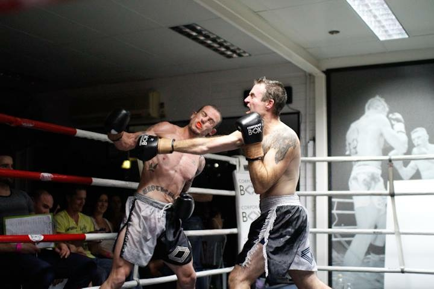
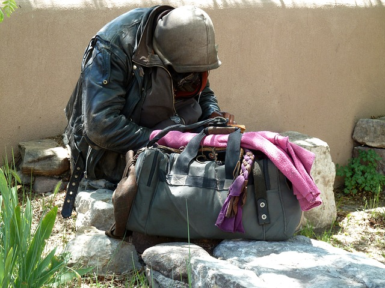

| [Home](../index.html) | [Older Posts](../archive.html) |
| --------|--------|

 
##Meet Neil

***18th November 2018***

Hi I’m Neil Woodroffe, Occupational Therapist from Australia and we're doing occupations. I thought I’d start off by telling you a bit about myself and my journey about becoming and being an Occupational Therapist. 

I didn't make the common journey straight from high school to university. Due to poor attendance at high school, I ceased my schooling prior to the end of my senior year. At this stage in my life, I guess you could say my main roles were partier and loiterer. After approximately 6 months of partying, I finally decided to get a job as a kitchen hand. I then changed jobs for several years and worked in various factory and labouring positions. At the age of 19, I met a good mentor who reintroduced me to martial arts and encouraged me to return to education. 

I obtained my Senior Certificate in 1999 and was accepted into a Bachelor of Sport and Exercise Science at the University of the Sunshine Coast and completed the first year of the degree in 2001 (and later completed this degree in 2012). The pathway was still limited in Sport and Exercise Science at this time and I didn’t want to become just another Personal Trainer with a degree, so I submitted a late application to enrol in Physiotherapy. 

I had to pay extra for the late application, so I decided to put down a second preference. I remember flicking through the university course book and found this degree called Occupational Therapy, so I put this down as my second preference. I remember receiving my offer over the phone and to be given the news that I was accepted into a Bachelor of Occupational Therapy at the University of Queensland. Though I was initially disappointed, I decided to find out a little more about Occupational Therapy before declining the offer. I called the local hospital and spoke to an Occupational Therapist who advised me that Occupational Therapy was not a consolation prize. She advised me that Occupational Therapy was a rewarding career and involved helping people to regain function and perform their occupations. So after some further research and watching my nephew being assessed by an Occupational Therapist, I decided to accept the offer.

The Occupational Therapy degree was no walk in the park and as 1 of 7 males I was on a first name basis with most of the lecturers, but this did me no favours. It was 4 hard years of study and pracs, but I had fun. While studying, I managed to score some part-time work as a Disability Support Worker and in my final year as an Disability Employment Consultant with CRS (Commonwealth Rehabilitation Services) Australia. I also managed to take on the roles of husband and father during this period. I graduated in 2005 and was employed immediately as an Occupational Therapist/Rehabilitation Consultant with CRS Australia where I worked until 2007.

I wasn't enjoying the grind of Vocational Rehabilitation with a case load of 30+ clients and numerous Job Capacity Assessments, so I decided to to go work for a private work rehabilitation provider. The role was good, but I still wasn't having much fun and the reporting deadlines would often force me to take work home. 

One day after conducting an Office Ergonomic Assessment in the city, I decided to catch up with a mate (Social Worker) who was working for the Homeless Health Outreach Team (HHOT), Mental Health Service in Brisbane City. I explained that I was feeling a burnt out, so he suggested coming to work for HHOT. I was introduced to the team leader and the mental health discipline lead of Occupational Therapy who instantly offered me a job.

For the first 4 years I really enjoyed working for HHOT. There was heaps of variety and position was extremely suited to Occupational Therapy (HHOT - HH = OT). Probably my first most memorable moment was hiking up Mt Coot-tha with police to assess a homeless man who was camping out and lighting fires, but there were many more interesting cases too come. Looking back this was probably the best job I have ever had, but for some reason I thought I was missing out on the physical areas of Occupational Therapy. 

I ended up taking a few secondments in physical health with the Community Based Rehabilitation Team (neurological home based rehabilitation) and the Primary Health Team (home modifications). Each role further enhanced my knowledge of Occupational Therapy Practice, but in both instances I ended up returning to mental health. 

In 2012, I was strongly encouraged to work at the Mental Health Community Care Unit as the Recreation Officer/Occupational Therapist to improve the health and fitness of residents/clients. I enjoyed running the recreation and exercise programs for clients, but after 2 years I needed a change, so I put in a request to transfer back to the Community Mental Health Team. I did a few secondments with the Mobile Intensive Rehabilitation Team (which I enjoyed), but I felt the shift-work negatively affected my family life. I eventually transferred back to a Community Mental Health Team, which only offered standard work hours. 

In 2015, I decided to take Long Service Leave and start my own Occupational Therapy business called FitOT. I spent a year coming up with a business plan and I organised 4 Occupational Therapy contracts. Unfortunately 2 of the 4 contracts were not lucrative and I could not sustain the business, so I returned to my full-time OT role with public health. I managed to secure another part-time contract, which involved conducting home assessments on the weekend, but this took a toll on my family life, so I ceased the business in mid 2016.

Since 2016, I have been working in Redcliffe Adult Mental Health, which is a really great team, plus it is close to home. Since working close to home, I have been able to better manage work-life balance. So what's next? I'm not exactly sure, but I love the idea of creating and sharing new Occupational Therapy ideas and projects. 

Thanks for reading!

***Keep on doing occupations!***

***

 Doing Occupations (2018) 
