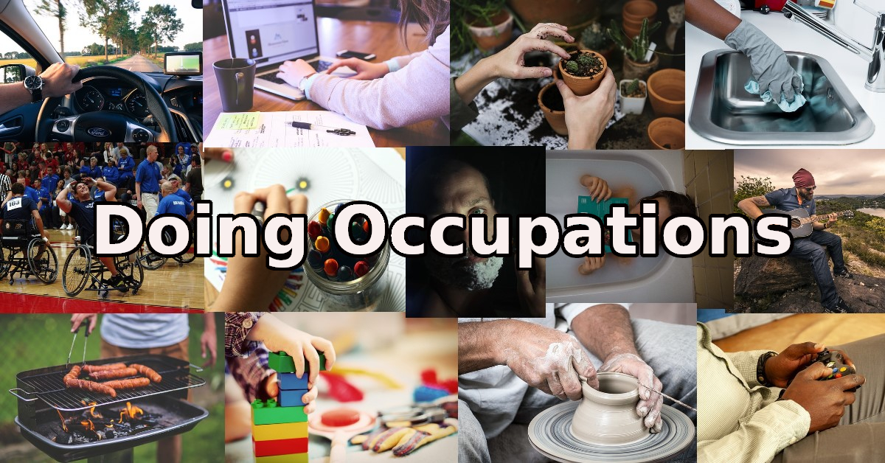

| [Home](../index.html) | [Previous Posts](../archive.html) |
| --------|--------|

 
##Questioning My OT Career

***10th November 2019***

We're doing occupations. Welcome to the ninth blog post in this series. The main aim of this blog is to talk about Occupational Therapy and Occupational Science. 

Many Occupational Therapists, like myself start their careers with a clear direction to work in a particular area of practice. For myself this was work rehabilitation. After working in work rehabilitation for 2.5 years, I realised that it wasn't for me, so made the move to community mental health. I found that every few years I again began to question my career direction. I then tried community neurological rehabilitation, primary care and my own private practice, but for some reason I always seemed to return to community mental health.

Recently I've been experiencing some burnout in my work role and have started to question whether I even want to remain in the Occupational Therapy field. Thinking I should move into a different career in sport/exercise or information technology. I guess its perfectly normal to feel this way, as many people change careers during there lifetime. But was I over analysing it, was I subconsciously assessing myself, no I was consciously assessing my goals, roles and occupations. So my theory is, "Occupational Therapists start to question and analyse their own goals, roles and occupations, because that is what Occupational Therapists are trained to do".

So now that I've had time to reflect (another skill we are trained to do), I think I will remain working as a clinical Occupational Therapist for now. I am trying to incorporate my other meaningful occupations (sport/exercise and information technology) into my Occupational Therapy practice. I have reviewed my goals and I think it is time to take a step towards Occupational Therapy academia.

***Keep on doing occupations!***

[Neil Woodroffe, Occupational Therapist](../archive/meet_neil.html)

***

 Doing Occupations (2019) 
