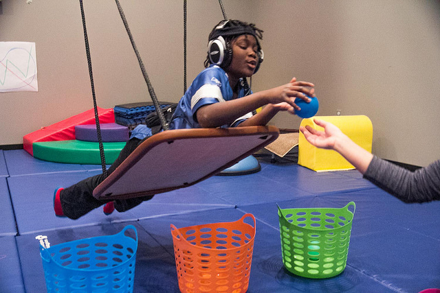

| [Home](index.html) | [Older Posts](archive.html) |
| --------|--------|

 
##Occupation

***3rd February 2019***

We're doing occupations. Welcome to the second blog post in this series. The main aim of this blog is to talk about Occupational Therapy and Occupational Science. 

You have probably noticed the introduction picture of someone weaving a basket and yes I am proud of it, thanks Pixabay. The reason why I chose this picture is because it reminds me of the core idea behind Occupational Therapy, which is helping people to do occupations. In 2019, I definitely don't prescribe basket weaving as a therapeutic intervention (and never have), but it would have been very relevant activity in the early 1900s in a time of manufacturing. Basket weaving and similar arts and crafts activities could be used as an intervention to simulate manual labouring or factory work. I could imagine the main goal of most patients in this time would have been to return to work or return to caring for their families.

Obviously, we have come a long way since the early days of OT as we now have many frameworks of practice, scientific evidence and hundreds of specific assessments and interventions, but the core idea of helping people to do occupations has not changed. I still believe that the best assessment is observing the person performing the occupation and the best intervention is to help them to re-engage in the occupation.

It is good to reflect on our past, but it is more important to change and adapt with the future. Technology has changed how we perform most occupations and it is continually evolving. Though arts and crafts may still be used as a bed side intervention, it may be now more relevant to use a tablet or an iPad. But no matter what assessments and interventions we choose, the main point is that we help clients to return to doing occupations that are meaningful and purposeful for them and this core Occupational Therapy idea has not changed.

***Lets do occupations!***

[Neil Woodroffe, Occupational Therapist](archive/meet_neil.html)

***

 Doing Occupations (2019) 
