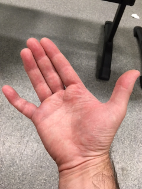
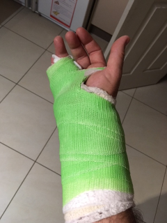

| [Home](index.html) | [Older Posts](archive.html) |
| --------|--------|

 
##My Hand Function

***30th December 2018***

Hi I'm [Neil Woodroffe, Occupational Therapist](archive/meet_neil.html) and we're doing occupations. Welcome and the first ever blog post in this series. The main aim of this blog is to talk about Occupational Therapy and Occupational Science. 

So what better way to start this blog series by talking about my hand function. In October, I was engaging in my routine BJJ/Wrestling class and my finger got caught on my opponent's shirt and then he landed on my hand. Initially it felt like I had snapped of my finger off, but surprisingly the intense acute pain subsided quickly. I was able to drive home and have a shower and then drive myself to the local emergency department.

My dominate little finger (right 5th proximal phalanx) was badly fractured, it had to be relocated twice and luckily it did not require surgery. I was placed in cast for 5 weeks, which also restricted wrist movement. During these 5 weeks I had difficulties or was unable to perform many occupations such as:

- Having a shower
- Doing the dishes
- Driving the car at work
- Handwriting
- Training at the gym
- Mowing the lawn
- Lifting and carrying heavy objects
- etc, etc, etc

I guess your expecting to hear that as an Occupational Therapist I coped really well. You'd also expect that I easily adapted tasks and effectively used assistive equipment to independently complete my occupations. Well not as good as you'd expect and in fact I became dependent on my wife to perform many tasks around the home. Not only did this increase my wife's workload at home, but also her stress levels. Lets just say, she was really happy when the cast was removed and I was able to restart most of my daily occupations.
 
I became a bit depressed during this period and probably drank too much alcohol. I began to think about how much I actually valued the simplest tasks and how I had become a burden on others to complete my daily occupations.

During my rehabilitation, I have found that most of my recovery has come from actively engaging in occupations rather than just routinely performing active and passive range of motion and strength exercises. Unfortunately rehabilitation hasn't gone without difficulties, as I had a tendon adhesion and a suspected FDS tendon tear, but luckily I have now regained full range of movement.

It's funny how much I really value being able to do the dishes and activities around the home again. I now have personal experience with temporary loss of hand function and how this impacted my mental health. I also have a real appreciation about the impact of disability on carers.

***It's great to be back doing occupations!***

***

 Doing Occupations (2018) 
