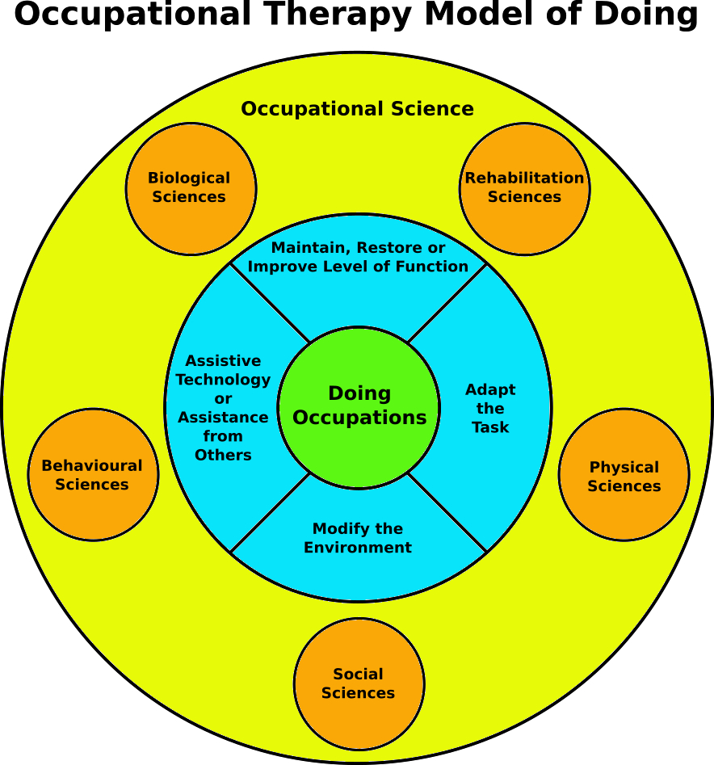

| [Home](index.html) | [Older Posts](archive.html) |
| --------|--------|

 
##Occupational Model of Doing (OTMOD)

***12th May 2019***

We're doing occupations. Welcome to the fifth blog post in this series. The main aim of this blog is to talk about Occupational Therapy and Occupational Science. 

I was recently thinking about how and why Occupational Therapy is not well understood by people outside the profession. I envisioned a concept of using cartoon characters to help define and market OT to the public and as a result [TEAM OT](https://neilwoodroffe.github.io/what-is-ot/) was born:

- Dot: The importance of doing occupations
- Scot: The science behind Occupational Therapy
- Robot: Adapt, modify and assist

I then envisioned the Occupational Model of Doing (OTMOD), which could be applied using the three concepts outlined by Team OT.

The following is a summary of OTMOD:

The green centre circle identifies the core principle of Occupational Therapy, which is that people need to do occupations (human activities) to have purposeful and meaningful lives. Occupational Therapists understand that people with barriers can have difficulties performing occupations. This knowledge of occupation is mainly derived from the science behind Occupational Therapy namely Occupational Science. 

The large yellow circle represents Occupational Science, which is the study of human occupation. Occupational Science aims to explain why and how people perform occupations and provides scientific evidence to guide Occupational Therapy practice. However, in order to truly and holistically understand occupation one must have an thorough understanding of all sciences (orange circles) that affect or explain human activity. Occupational Therapists are taught general sciences including Anatomy, Physiology, Sociology and Psychology etc. Occupational Therapy itself is generally classified under the umbrella of Rehabilitative Sciences, which aims to use evidence based (scientifically proven) assessment and treatment modalities. Many Occupational Therapists also gain a good understanding of Ergonomics and Biomechanics. Many factors can affect human participation in occupations, so additional studies in sciences such as Physics, Biochemistry, Anthropology and Environmental Science etc can help us to further understand human occupation.

The blue circle identifies that people with barriers may need Occupational Therapy assessment and treatment to maintain, restore or improve function, but unfortunately it is not always possible to achieve this. In these cases, the Occupational Therapist may need to adapt the task, modify the environment, prescribe assistive technology or recommend assistance from others to enable the client to do their purposeful and meaningful occupations.

One key difference between OTMOD and other OT models is the inclusion of Occupational Science and other sciences. Occupational Therapy would not be around today without the science behind its practice!

***Keep on doing occupations!***

[Neil Woodroffe, Occupational Therapist](archive/meet_neil.html)

***

 Doing Occupations (2019) 
