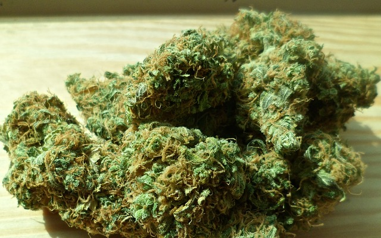

| [Home](index.html) | [Older Posts](archive.html) |
| --------|--------|

 
##Drug Induced Psychosis

***10th April 2019***

We're doing occupations. Welcome to the fourth blog post in this series. The main aim of this blog is to talk about Occupational Therapy and Occupational Science. 

I am going to tell you a story about myself that I am not proud of and that is why I haven't openly shared this story before. Between the ages of 16 to 19, I was regularly using a variety of drugs and I guess you could say that smoking cannabis was one of my daily occupations. At the age of 18½, I started training Kung Fu. I would usually use drugs before each daily Kung Fu training session. Over period of a few months, I started to develop some grandiose and delusional beliefs that I was developing chi power and that certain people were possessed by demons. My activities of daily living started to decline. I became paranoid and developed inappropriate social behaviour, which resulted in the loss of my job. 

One night I believed that my training partner was the son of the devil, who was sent to the destroy the world. I remember being so frightened that I ran 10 kilometres to my Kung Fu Master's home to tell him what I had discovered. I also told him that I had been using drugs. The Master became was very worried about me; he advised me to stop using drugs and then drove me home to go to sleep. Unfortunately I didn't sleep very well that night, as I believed that there was a demon outside my house that was trying to kill me.

The next day I asked my friend to take me to the local hospital for a psychiatric assessment. The psychiatrist told me that I had experienced a drug induced psychotic episode, he provided me with psycho-education and recommended that I cease all drug use. Luckily, I didn't need to be commenced on anti-psychotic medication. This negative event scared me so much, that I immediately ceased all drug use. I didn't even drink any alcohol for 6 months. The Kung Fu Master also asked me to attend the Thai Temple to be blessed by a Buddhist Priest, which actually helped to calm my thoughts. It took me a week or two to feel normal again and to fully regain my occupational functioning.

I soon found a good long-term job, eventually returned to study and I became an Occupational Therapist approximately 11 years later. Though I wouldn't recommend this pathway to anyone, this lived experience has helped me to relate to clients with similar experiences and to better understand how drugs can negatively affect occupational performance.

***Keep on doing occupations!***

[Neil Woodroffe, Occupational Therapist](archive/meet_neil.html)

***

 Doing Occupations (2019) 
