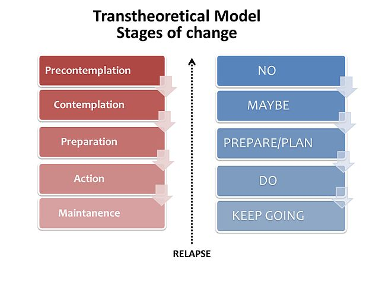

| [Home](index.html) | [Previous Posts](archive.html) |
| --------|--------|

 
##Motivating Clients to Change?

***2nd February 2020***

We're doing occupations. Welcome to the 11th blog post in this series. The main aim of this blog is to talk about Occupational Therapy and Occupational Science. 

Most Occupational Therapists have come across at least one client who has declined to participate in treatment or did not accept recommendations for assistive equipment. Obviously, we can't force someone to agree to Occupational Therapy treatment, so we are left to justify the client's decision in our clinical notes. But should we do more? Of course we should! Firstly, we need to explore why the client does not want to change or engage in treatment. [The Transtheoretical Model (Stages of Change)](https://www.prochange.com/transtheoretical-model-of-behavior-change) can be used to identify a client's current motivation to change. The picture below shows movement through stages as a linear progression, though movement can occur back and forth between the stages.

Motivational Interviewing involves techniques that can be used to help clients to move through the stages of change. Over the years I have taken part in several Motivational Interviewing courses and I would recommend that all Occupational Therapists learn the principles of Motivational Interviewing. Below is a YouTube Clip by Dr Bill Matulich introducing Motivational Interviewing:
 

<iframe width="448" height="252" src="https://www.youtube.com/embed/s3MCJZ7OGRk" frameborder="0" allow="accelerometer; autoplay; encrypted-media; gyroscope; picture-in-picture" allowfullscreen></iframe>

 
Occupational Therapists working in inpatient services who experience clients with poor volition, may experience limited time to evoke change. In such cases, it would be beneficial to refer to a community based Occupational Therapist, who will likely have more time to help the client to make some positive changes using The Transtheoretical Model and Motivational Interviewing techniques.

***Keep on doing occupations!***

[Neil Woodroffe, Occupational Therapist](archive/meet_neil.html)

***

 Doing Occupations (2020) 
